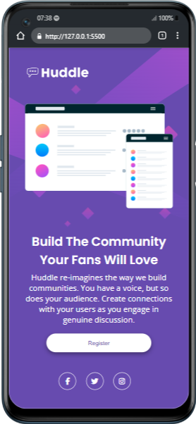

# Huddle Landing Page

Esta é a solução para o desafio [Huddle landing page with single introductory section no Frontend Mentor](https://www.frontendmentor.io/challenges/huddle-landing-page-with-a-single-introductory-section-B_2Wvxgi0).

## Tecnologias utilizadas

- HTML5
- CSS3
- Google Fonts (`Open Sans`, `Poppins`)
- Font Awesome (Icons)
- Flexbox

## Detalhes do layout

- Layout responsivo com Flexbox.
- Estilização nos botões e icons com sombras, bordas e hover.
- Tipografia com fontes externas.

## Imagens do desafio finalizado

